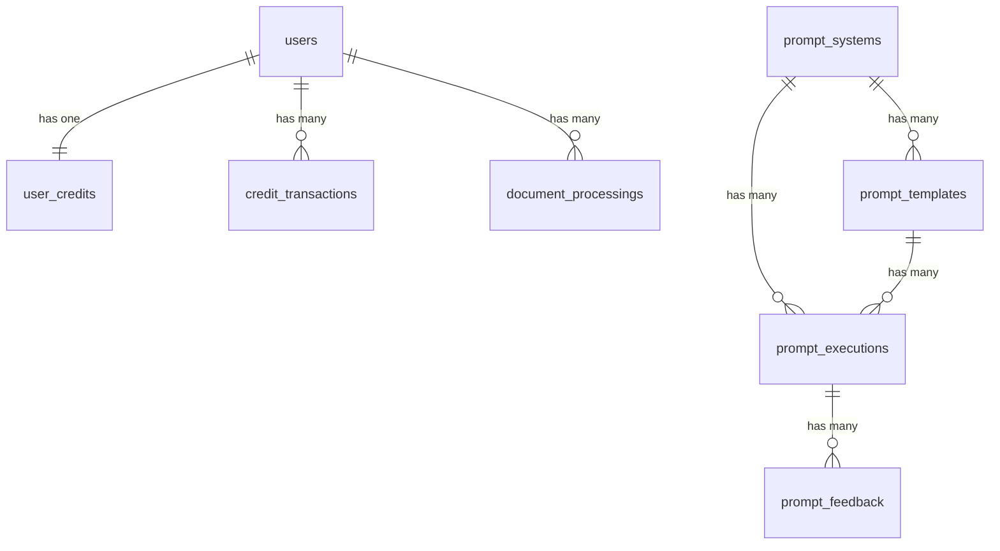

# Database Schema Documentation

## Обзор

База данных проекта **Растолкуй** построена на PostgreSQL и состоит из 8 основных моделей, организованных в 4 логических домена:

1. **User Management** - управление пользователями и аутентификация
2. **Credit System** - кредитная система и биллинг 
3. **Document Processing** - обработка документов
4. **AI Prompt System** - система ИИ промптов

## Диаграмма связей



---

## Domain 1: User Management

### users
Основная таблица пользователей с аутентификацией и верификацией email.

```sql
CREATE TABLE users (
    id BIGINT PRIMARY KEY AUTO_INCREMENT,
    name VARCHAR(255) NOT NULL,
    email VARCHAR(255) UNIQUE NOT NULL,
    email_verified_at TIMESTAMP NULL,
    password VARCHAR(255) NOT NULL,
    remember_token VARCHAR(100) NULL,
    created_at TIMESTAMP NULL,
    updated_at TIMESTAMP NULL,
    
    INDEX idx_users_email (email),
    INDEX idx_users_created_at (created_at)
);
```

**Особенности:**
- Использует Laravel Sanctum для API аутентификации
- Интегрирована с Spatie Permission для ролей
- Поддержка верификации email
- Хеширование паролей через bcrypt

**Связи:**
- `hasOne(UserCredit)` - баланс кредитов
- `hasMany(CreditTransaction)` - история транзакций
- `hasMany(DocumentProcessing)` - документы пользователя

---

## Domain 2: Credit System

### user_credits
Баланс кредитов пользователей для freemium модели.

```sql
CREATE TABLE user_credits (
    id BIGINT PRIMARY KEY AUTO_INCREMENT,
    user_id BIGINT NOT NULL,
    balance DECIMAL(15,2) NOT NULL DEFAULT 0.00,
    created_at TIMESTAMP NULL,
    updated_at TIMESTAMP NULL,
    deleted_at TIMESTAMP NULL,
    
    FOREIGN KEY (user_id) REFERENCES users(id) ON DELETE CASCADE,
    UNIQUE KEY unique_user_credit (user_id),
    INDEX idx_balance (balance)
);
```

**Особенности:**
- Soft deletes для аудита
- Точные вычисления с DECIMAL(15,2)
- Уникальный баланс на пользователя

**Ключевые методы:**
- `hasSufficientBalance(float $amount): bool`
- `addBalance(float $amount): void`
- `subtractBalance(float $amount): void`

### credit_transactions
Полный аудит всех операций с кредитами.

```sql
CREATE TABLE credit_transactions (
    id BIGINT PRIMARY KEY AUTO_INCREMENT,
    user_id BIGINT NOT NULL,
    type VARCHAR(50) NOT NULL, -- 'topup'|'debit'|'refund'
    amount DECIMAL(15,2) NOT NULL,
    balance_before DECIMAL(15,2) NOT NULL,
    balance_after DECIMAL(15,2) NOT NULL,
    description VARCHAR(500) NOT NULL,
    metadata JSON NULL,
    reference_id VARCHAR(255) NULL,
    reference_type VARCHAR(255) NULL,
    created_at TIMESTAMP NULL,
    updated_at TIMESTAMP NULL,
    deleted_at TIMESTAMP NULL,
    
    FOREIGN KEY (user_id) REFERENCES users(id) ON DELETE CASCADE,
    INDEX idx_user_id (user_id),
    INDEX idx_type (type),
    INDEX idx_reference (reference_type, reference_id),
    INDEX idx_created_at (created_at)
);
```

**Типы транзакций:**
- `topup` - пополнение кредитов
- `debit` - списание за услуги
- `refund` - возврат кредитов

**Особенности:**
- Отслеживание баланса до/после операции
- Внешние ссылки для интеграции с платежами
- Метаданные в JSON для дополнительной информации
- Soft deletes для аудита

---

## Domain 3: Document Processing

### document_processings
Центральная таблица для обработки юридических документов.

```sql
CREATE TABLE document_processings (
    id BIGINT PRIMARY KEY AUTO_INCREMENT,
    user_id BIGINT NOT NULL,
    uuid VARCHAR(36) UNIQUE NOT NULL,
    original_filename VARCHAR(500) NOT NULL,
    file_path VARCHAR(1000) NOT NULL,
    file_type VARCHAR(100) NOT NULL,
    file_size BIGINT NOT NULL,
    task_type VARCHAR(50) NOT NULL, -- 'translation'|'contradiction'|'ambiguity'
    options JSON NULL,
    anchor_at_start BOOLEAN DEFAULT FALSE,
    status ENUM('pending', 'processing', 'completed', 'failed') DEFAULT 'pending',
    result LONGTEXT NULL,
    error_details JSON NULL,
    processing_metadata JSON NULL,
    processing_time_seconds DECIMAL(8,3) NULL,
    cost_usd DECIMAL(10,6) NULL,
    started_at TIMESTAMP NULL,
    completed_at TIMESTAMP NULL,
    created_at TIMESTAMP NULL,
    updated_at TIMESTAMP NULL,
    deleted_at TIMESTAMP NULL,
    
    FOREIGN KEY (user_id) REFERENCES users(id) ON DELETE CASCADE,
    INDEX idx_uuid (uuid),
    INDEX idx_status (status),
    INDEX idx_user_created (user_id, created_at),
    INDEX idx_task_type (task_type)
);
```

**Статусы обработки:**
- `pending` - ожидает обработки
- `processing` - в процессе
- `completed` - завершено успешно
- `failed` - ошибка обработки

**Типы задач:**
- `translation` - перевод на простой язык
- `contradiction` - поиск противоречий
- `ambiguity` - выявление неясностей

**Особенности:**
- UUID для публичной идентификации
- Отслеживание времени и стоимости обработки
- Детальные метаданные и ошибки в JSON
- Soft deletes для истории

---

## Domain 4: AI Prompt System

### prompt_systems
Конфигурационный хаб для управления ИИ промптами.

```sql
CREATE TABLE prompt_systems (
    id BIGINT PRIMARY KEY AUTO_INCREMENT,
    name VARCHAR(255) UNIQUE NOT NULL,
    type VARCHAR(100) NOT NULL,
    description TEXT NULL,
    system_prompt TEXT NOT NULL,
    default_parameters JSON NULL,
    schema JSON NULL,
    is_active BOOLEAN DEFAULT TRUE,
    version VARCHAR(10) DEFAULT '1.0.0',
    metadata JSON NULL,
    created_at TIMESTAMP NULL,
    updated_at TIMESTAMP NULL,
    
    INDEX idx_type_active (type, is_active)
);
```

**Особенности:**
- JSON Schema валидация ответов ИИ
- Системные промпты по умолчанию
- Версионирование промптов
- Иерархическая организация

### prompt_templates
Параметризированные шаблоны с подстановкой переменных.

```sql
CREATE TABLE prompt_templates (
    id BIGINT PRIMARY KEY AUTO_INCREMENT,
    prompt_system_id BIGINT NOT NULL,
    name VARCHAR(255) NOT NULL,
    template TEXT NOT NULL,
    required_variables JSON NOT NULL,
    optional_variables JSON NULL,
    description TEXT NULL,
    is_active BOOLEAN DEFAULT TRUE,
    metadata JSON NULL,
    created_at TIMESTAMP NULL,
    updated_at TIMESTAMP NULL,
    
    FOREIGN KEY (prompt_system_id) REFERENCES prompt_systems(id) ON DELETE CASCADE,
    UNIQUE KEY unique_system_template (prompt_system_id, name),
    INDEX idx_system_active (prompt_system_id, is_active)
);
```

**Особенности:**
- Mustache-style шаблонизация `{{variable}}`
- Строгая валидация переменных
- Область видимости в рамках системы

### prompt_executions
Полный аудит взаимодействий с ИИ.

```sql
CREATE TABLE prompt_executions (
    id BIGINT PRIMARY KEY AUTO_INCREMENT,
    prompt_system_id BIGINT NOT NULL,
    prompt_template_id BIGINT NULL,
    execution_id VARCHAR(36) UNIQUE NOT NULL,
    rendered_prompt TEXT NOT NULL,
    llm_response LONGTEXT NULL,
    input_variables JSON NOT NULL,
    model_used VARCHAR(100) NULL,
    tokens_used INTEGER NULL,
    execution_time_ms DECIMAL(10,2) NULL,
    cost_usd DECIMAL(10,6) NULL,
    status VARCHAR(50) DEFAULT 'pending',
    error_message TEXT NULL,
    quality_metrics JSON NULL,
    metadata JSON NULL,
    started_at TIMESTAMP NULL,
    completed_at TIMESTAMP NULL,
    created_at TIMESTAMP NULL,
    updated_at TIMESTAMP NULL,
    
    FOREIGN KEY (prompt_system_id) REFERENCES prompt_systems(id) ON DELETE CASCADE,
    FOREIGN KEY (prompt_template_id) REFERENCES prompt_templates(id) ON DELETE SET NULL,
    INDEX idx_execution_id (execution_id),
    INDEX idx_system_status (prompt_system_id, status),
    INDEX idx_started_at (started_at)
);
```

**Особенности:**
- Мониторинг производительности
- Отслеживание стоимости с точностью до микроцентов
- Метрики качества
- UUID для внешнего трекинга

### prompt_feedback
Система обратной связи для улучшения качества.

```sql
CREATE TABLE prompt_feedback (
    id BIGINT PRIMARY KEY AUTO_INCREMENT,
    prompt_execution_id BIGINT NOT NULL,
    feedback_type VARCHAR(50) NOT NULL, -- 'quality'|'accuracy'|'relevance'
    rating DECIMAL(3,2) NULL, -- 0.00 to 5.00
    comment TEXT NULL,
    details JSON NULL,
    user_type VARCHAR(50) DEFAULT 'anonymous', -- 'human'|'system'|'automated'
    user_id VARCHAR(255) NULL,
    metadata JSON NULL,
    created_at TIMESTAMP NULL,
    updated_at TIMESTAMP NULL,
    
    FOREIGN KEY (prompt_execution_id) REFERENCES prompt_executions(id) ON DELETE CASCADE,
    INDEX idx_execution_feedback (prompt_execution_id),
    INDEX idx_type_rating (feedback_type, rating),
    INDEX idx_created_at (created_at)
);
```

**Типы обратной связи:**
- `quality` - качество ответа
- `accuracy` - точность информации  
- `relevance` - релевантность контексту

---

## Система разрешений (Spatie Permission)

### model_has_permissions
Прямые разрешения пользователей.

```sql
CREATE TABLE model_has_permissions (
    permission_id BIGINT NOT NULL,
    model_type VARCHAR(255) NOT NULL,
    model_id BIGINT NOT NULL,
    
    FOREIGN KEY (permission_id) REFERENCES permissions(id) ON DELETE CASCADE,
    PRIMARY KEY (permission_id, model_id, model_type),
    INDEX idx_model (model_id, model_type)
);
```

### model_has_roles  
Роли пользователей.

```sql
CREATE TABLE model_has_roles (
    role_id BIGINT NOT NULL,
    model_type VARCHAR(255) NOT NULL,
    model_id BIGINT NOT NULL,
    
    FOREIGN KEY (role_id) REFERENCES roles(id) ON DELETE CASCADE,
    PRIMARY KEY (role_id, model_id, model_type),
    INDEX idx_model (model_id, model_type)
);
```

### permissions
Системные разрешения.

```sql
CREATE TABLE permissions (
    id BIGINT PRIMARY KEY AUTO_INCREMENT,
    name VARCHAR(255) NOT NULL,
    guard_name VARCHAR(255) NOT NULL,
    created_at TIMESTAMP NULL,
    updated_at TIMESTAMP NULL,
    
    UNIQUE KEY unique_permission (name, guard_name)
);
```

**Основные разрешения:**
- `documents.create` - создание документов
- `documents.view` - просмотр документов
- `documents.cancel` - отмена обработки
- `documents.delete` - удаление документов

### roles
Роли системы.

```sql
CREATE TABLE roles (
    id BIGINT PRIMARY KEY AUTO_INCREMENT,
    name VARCHAR(255) NOT NULL,
    guard_name VARCHAR(255) NOT NULL,
    created_at TIMESTAMP NULL,
    updated_at TIMESTAMP NULL,
    
    UNIQUE KEY unique_role (name, guard_name)
);
```

**Основные роли:**
- `admin` - администратор системы
- `user` - обычный пользователь

---

## Вспомогательные таблицы

### personal_access_tokens (Laravel Sanctum)
Токены API аутентификации.

```sql
CREATE TABLE personal_access_tokens (
    id BIGINT PRIMARY KEY AUTO_INCREMENT,
    tokenable_type VARCHAR(255) NOT NULL,
    tokenable_id BIGINT NOT NULL,
    name VARCHAR(255) NOT NULL,
    token VARCHAR(64) UNIQUE NOT NULL,
    abilities TEXT NULL,
    last_used_at TIMESTAMP NULL,
    expires_at TIMESTAMP NULL,
    created_at TIMESTAMP NULL,
    updated_at TIMESTAMP NULL,
    
    INDEX idx_tokenable (tokenable_type, tokenable_id)
);
```

### password_reset_tokens
Токены сброса паролей.

```sql
CREATE TABLE password_reset_tokens (
    email VARCHAR(255) PRIMARY KEY,
    token VARCHAR(255) NOT NULL,
    created_at TIMESTAMP NULL
);
```

### cache
Система кеширования Laravel.

```sql
CREATE TABLE cache (
    key VARCHAR(255) PRIMARY KEY,
    value MEDIUMTEXT NOT NULL,
    expiration INTEGER NOT NULL
);
```

---

## Оптимизация и производительность

### Стратегия индексирования

**Первичные индексы:**
- Все внешние ключи индексированы для производительности JOIN
- Поля статусов для фильтрации активных процессов
- Временные поля для запросов по датам
- Email поля для аутентификации

**Композитные индексы:**
- `(user_id, created_at)` для истории пользователя
- `(status, created_at)` для активных процессов
- `(prompt_system_id, is_active)` для активных шаблонов
- `(reference_type, reference_id)` для внешних ссылок

### Целостность данных

**Ограничения внешних ключей:**
- Cascade delete для записей пользователей
- Set null для опциональных ссылок
- Принудительная целостность ссылок

**Валидация и безопасность:**
- Пути файлов скрыты от API сериализации
- Точность DECIMAL для финансовых расчетов
- Soft deletes для критически важных записей
- Валидация JSON полей на уровне приложения

### Возможности бизнес-логики

**Кредитная система:**
- Атомарные обновления баланса с логированием
- Отслеживание баланса до/после для аудита
- Связывание внешних ссылок для интеграции платежей
- Поддержка мультивалютности через метаданные

**Обработка документов:**
- Комплексное отслеживание статусов с временными метками
- Расчет стоимости и интеграция биллинга
- Обработка ошибок с детальной диагностикой
- Позиционирование якорей для UI/UX

**AI Pipeline:**
- Валидация и подстановка переменных шаблонов
- Поддержка множественных моделей (Claude Sonnet/Haiku)
- Сбор и анализ метрик качества
- Мониторинг производительности и оптимизация

---

*Обновлено: 2025-08-29*