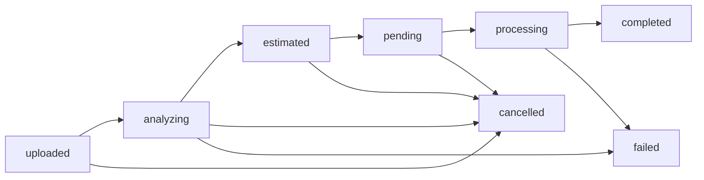

# Document Processing Workflow

## Обзор

С версии **RAS-19** в системе реализован новый трехэтапный процесс обработки документов, который обеспечивает лучший контроль над стоимостью и прозрачность для пользователей.

### Основные преимущества нового workflow:

- 💰 **Предварительная оценка стоимости** - пользователь видит цену до списания кредитов
- ⚡ **Быстрая загрузка** - файл сохраняется мгновенно, обработка запускается по запросу  
- 🎯 **Гибкость выбора** - возможность изменить параметры обработки после загрузки
- 💳 **Контроль бюджета** - защита от неожиданных списаний

---

## Детальное описание этапов

### Этап 1: Upload (Загрузка файла) 📁

**Endpoint**: `POST /v1/documents/upload`

**Что происходит:**
1. Файл валидируется (размер, формат, безопасность)
2. Генерируется уникальный UUID для документа
3. Файл сохраняется в хранилище `storage/documents/`
4. Создается запись в БД со статусом `uploaded`
5. Возвращается информация о документе

**Статус документа**: `uploaded` (progress: 10%)

```php
// DocumentProcessingService.php
public function uploadDocument(UploadDocumentDto $dto, User $user): DocumentProcessing
{
    // 1. Генерация UUID и имени файла
    $uuid = Str::uuid()->toString();
    $filename = $uuid . '.' . $dto->file->getClientOriginalExtension();
    
    // 2. Сохранение файла
    $filePath = $dto->file->storeAs('documents', $filename, 'local');
    
    // 3. Создание записи с статусом uploaded
    $documentProcessing = DocumentProcessing::create([
        'status' => DocumentProcessing::STATUS_UPLOADED,
        // ... другие поля
    ]);
    
    return $documentProcessing;
}
```

**Валидация файлов:**
- **Размер**: до 50MB
- **Форматы**: PDF, DOCX, TXT
- **Безопасность**: проверка на вредоносный контент
- **Кодировка**: автоопределение для текстовых файлов

---

### Этап 2: Estimate (Оценка стоимости) 💰

**Endpoint**: `POST /v1/documents/{uuid}/estimate`

**Изменения в RAS-27**: Анализ структуры документа теперь выполняется асинхронно через очередь `document-analysis`.

**Что происходит:**
1. Проверяется статус документа (должен быть `uploaded`)
2. **Новое**: Статус меняется на `analyzing` и запускается `AnalyzeDocumentStructureJob`
3. Асинхронно выполняется анализ структуры документа
4. После завершения анализа рассчитывается стоимость в USD и кредитах
5. Проверяется достаточность баланса пользователя
6. Статус меняется на `estimated`

**Статусы документа**: `uploaded` → `analyzing` (15%) → `estimated` (20%)

```php
// DocumentProcessingService.php - Обновленная версия с асинхронным анализом (RAS-27)
public function estimateDocumentCost(DocumentProcessing $documentProcessing, EstimateDocumentDto $dto): DocumentProcessing
{
    // 1. Проверка статуса
    if (!$documentProcessing->isUploaded()) {
        throw new InvalidArgumentException('Document must be in uploaded status for estimation');
    }

    // 2. Переход к статусу анализа
    $documentProcessing->markAsAnalyzing();

    // 3. Запуск асинхронного анализа структуры через очередь
    $queueName = config('document.queue.document_analysis_queue', 'document-analysis');
    
    AnalyzeDocumentStructureJob::dispatch($documentProcessing->id, $dto->model)
        ->onQueue($queueName)
        ->delay(now()->addSeconds(1));

    return $documentProcessing->fresh();
}

// Теперь анализ и расчет стоимости происходит в AnalyzeDocumentStructureJob:
// app/Jobs/AnalyzeDocumentStructureJob.php
public function handle(
    DocumentProcessingService $documentProcessingService,
    CostCalculator $costCalculator,
    CreditService $creditService
): void {
    $documentProcessing = DocumentProcessing::find($this->documentProcessingId);

    if (!$documentProcessing || !$documentProcessing->isAnalyzing()) {
        return;
    }

    try {
        // Анализ структуры документа
        $extractedDocument = $this->extractDocument($documentProcessing);
        $structureAnalysis = $this->analyzeStructure($extractedDocument);

        // Расчет стоимости на основе анализа
        $estimation = $costCalculator->estimateProcessingCost(
            fileSize: $documentProcessing->file_size,
            model: $this->model,
            structureComplexity: $structureAnalysis->averageConfidence
        );

        $creditsNeeded = $creditService->convertUsdToCredits($estimation['estimated_cost_usd']);
        $user = $documentProcessing->user;
        $hasSufficientBalance = $creditService->hasSufficientBalance($user, $creditsNeeded);

        // Сохранение результатов анализа и оценки
        $estimationData = [
            'estimated_cost_usd' => $estimation['estimated_cost_usd'],
            'credits_needed' => $creditsNeeded,
            'has_sufficient_balance' => $hasSufficientBalance,
            'user_balance' => $creditService->getBalance($user),
            'model_selected' => $this->model,
            'analysis_duration_ms' => $structureAnalysis->analysisTime * 1000,
        ];

        $documentProcessing->markAsEstimatedWithStructure($estimationData, [
            'sections_count' => $structureAnalysis->getSectionsCount(),
            'average_confidence' => $structureAnalysis->averageConfidence,
            'analysis_warnings' => $structureAnalysis->warnings,
        ]);

    } catch (Exception $e) {
        $documentProcessing->markAsFailed('Structure analysis failed', [
            'error' => $e->getMessage(),
            'stage' => 'structure_analysis',
        ]);
    }
}
```

**Алгоритм расчета стоимости:**

1. **Оценка токенов по размеру файла**:
   ```php
   // Эмпирическая формула: ~4 символа = 1 токен
   $estimatedInputTokens = $fileSizeBytes / 4;
   ```

2. **Расчет output токенов**:
   ```php
   // Коэффициент 1.5x для переводов (эмпирический)
   $estimatedOutputTokens = $estimatedInputTokens * 1.5;
   ```

3. **Стоимость по актуальным ценам Claude**:
   ```php
   // Цены на 2025 год за 1M токенов
   $pricing = [
       'claude-sonnet-4' => ['input' => 3.00, 'output' => 15.00],
       'claude-3-5-haiku' => ['input' => 0.25, 'output' => 1.25],
   ];
   ```

---

### Этап 3: Process (Запуск обработки) ⚙️

**Endpoint**: `POST /v1/documents/{uuid}/process`

**Что происходит:**
1. Проверяется статус документа (должен быть `estimated`)
2. Повторно проверяется баланс кредитов
3. В транзакции:
   - Списываются кредиты с аккаунта
   - Статус меняется на `pending`
   - Создается транзакция в `credit_transactions`
4. Документ ставится в очередь на асинхронную обработку
5. Job обработки запускается через 2 секунды

**Статусы**: `pending` → `processing` → `completed`/`failed`

```php
// DocumentProcessingService.php
public function processEstimatedDocument(DocumentProcessing $doc): DocumentProcessing
{
    // 1. Проверки
    if (!$doc->isEstimated()) {
        throw new InvalidArgumentException('Document must be in estimated status');
    }
    
    $creditsNeeded = $doc->processing_metadata['estimation']['credits_needed'];
    
    if (!$this->creditService->hasSufficientBalance($user, $creditsNeeded)) {
        throw new InvalidArgumentException('Insufficient balance');
    }
    
    // 2. Атомарная операция в транзакции
    return DB::transaction(function () use ($doc, $user, $creditsNeeded) {
        // Списываем кредиты
        $this->creditService->debitCredits(
            $user,
            $creditsNeeded,
            "Document processing: {$doc->original_filename}",
            'document_processing',
            $doc->uuid
        );
        
        // Меняем статус
        $doc->update(['status' => DocumentProcessing::STATUS_PENDING]);
        
        // Запускаем Job
        ProcessDocumentJob::dispatch($doc->id)
            ->onQueue('document-processing')
            ->delay(now()->addSeconds(2));
            
        return $doc->fresh();
    });
}
```

---

## Модель данных и статусы

### Статусы документа

```php
// DocumentProcessing Model
public const string STATUS_UPLOADED = 'uploaded';    // Файл загружен (10%)
public const string STATUS_ANALYZING = 'analyzing';  // Анализ структуры (15%) - Новое в RAS-27
public const string STATUS_ESTIMATED = 'estimated';  // Стоимость рассчитана (20%) 
public const string STATUS_PENDING = 'pending';      // В очереди на обработку (25%)
public const string STATUS_PROCESSING = 'processing'; // Обрабатывается (50%)
public const string STATUS_COMPLETED = 'completed';  // Завершено успешно (100%)
public const string STATUS_FAILED = 'failed';        // Ошибка обработки (0%)
public const string STATUS_CANCELLED = 'cancelled';  // Отменено пользователем (0%)
```

### Переходы между статусами



### Ключевые поля БД

```sql
-- Основная информация
uuid VARCHAR(36) UNIQUE NOT NULL          -- Публичный идентификатор
status ENUM(...) DEFAULT 'uploaded'       -- Текущий статус
file_path VARCHAR(1000) NOT NULL          -- Путь к файлу
processing_metadata JSON NULL             -- Метаданные и оценки

-- Стоимость и время
cost_usd DECIMAL(10,6) NULL              -- Финальная стоимость
processing_time_seconds DECIMAL(8,3) NULL -- Время обработки

-- Результат
result LONGTEXT NULL                      -- JSON с результатом обработки
error_details JSON NULL                  -- Детали ошибок
```

---

## Обработка ошибок

### Типичные ошибки и коды ответов

**400 Bad Request** - Неверные данные запроса:
```json
{
  "message": "The given data was invalid.",
  "errors": {
    "file": ["The file field is required."],
    "task_type": ["The selected task type is invalid."]
  }
}
```

**409 Conflict** - Неверный статус документа:
```json
{
  "error": "Invalid document status", 
  "message": "Document must be in uploaded status for estimation"
}
```

**409 Conflict** - Недостаточно кредитов:
```json
{
  "error": "Cannot process document",
  "message": "Insufficient balance to process document"
}
```

**500 Internal Server Error** - Системные ошибки:
```json
{
  "error": "Processing failed to start",
  "message": "Не удалось запустить обработку документа"
}
```

### Стратегии восстановления

1. **Ошибки загрузки файлов**:
   - Автоматическая очистка временных файлов
   - Повтор загрузки с экспоненциальной задержкой

2. **Ошибки оценки стоимости**:
   - Fallback на стандартные тарифы
   - Логирование для мониторинга

3. **Ошибки обработки**:
   - Retry механизм в очереди (до 3 попыток)
   - Уведомления пользователя при критических ошибках

---

## Мониторинг и метрики

### Ключевые метрики для отслеживания

```php
// DocumentProcessingService::getStatistics()
[
    'total_processings' => 1250,
    'by_status' => [
        'uploaded' => 15,    // Загружено, ждут оценки
        'estimated' => 8,    // Оценено, ждут запуска  
        'pending' => 12,     // В очереди
        'processing' => 3,   // Обрабатываются
        'completed' => 1200, // Завершены
        'failed' => 8,       // С ошибками
        'cancelled' => 4     // Отменены
    ],
    'cost_stats' => [
        'total_cost_usd' => 1250.75,
        'average_cost_usd' => 1.04,
        'total_processing_time_hours' => 125.5
    ],
    'recent_stats' => [
        'last_24h' => 45,
        'last_week' => 320, 
        'last_month' => 1100
    ]
]
```

### Alerts и уведомления

1. **Высокий процент ошибок** (>5% за час)
2. **Длинная очередь** (>50 pending документов)
3. **Медленная обработка** (среднее время >30 сек)
4. **Дорогие операции** (стоимость >$5)

---

## Интеграция с кредитной системой

### Конвертация USD → Credits

```php
// CreditService::convertUsdToCredits()
public function convertUsdToCredits(float $usdAmount): float
{
    $rate = (float) Config::get('credits.conversion.usd_to_credits_rate', 100.0);
    return round($usdAmount * $rate, 2);
}

// Пример: $1.25 USD = 125.0 credits (при курсе 100:1)
```

### Транзакции кредитов

```php
// При запуске обработки создается запись:
CreditTransaction::create([
    'user_id' => $user->id,
    'type' => 'debit',           // Списание
    'amount' => -125.0,          // Отрицательная сумма
    'description' => 'Document processing: contract.pdf',
    'reference_type' => 'document_processing',
    'reference_id' => $documentUuid,
    'balance_before' => 500.0,
    'balance_after' => 375.0,
]);
```

---

## Примеры использования

### Полный цикл через API

```typescript
// 1. Загрузка файла
const uploadResponse = await fetch('/api/v1/documents/upload', {
  method: 'POST',
  headers: { 'Authorization': `Bearer ${token}` },
  body: formData // file + task_type + options
});
const { data: document } = await uploadResponse.json();

// 2. Получение оценки 
const estimateResponse = await fetch(`/api/v1/documents/${document.id}/estimate`, {
  method: 'POST',
  headers: { 
    'Authorization': `Bearer ${token}`,
    'Content-Type': 'application/json'
  },
  body: JSON.stringify({ task_type: 'translation' })
});
const { data: estimated } = await estimateResponse.json();

console.log(`Стоимость: ${estimated.estimation.credits_needed} кредитов`);
console.log(`Баланс достаточен: ${estimated.estimation.has_sufficient_balance}`);

// 3. Запуск обработки (если хватает средств)
if (estimated.estimation.has_sufficient_balance) {
  const processResponse = await fetch(`/api/v1/documents/${document.id}/process`, {
    method: 'POST',
    headers: { 'Authorization': `Bearer ${token}` }
  });
  
  // 4. Опрос статуса
  const pollStatus = setInterval(async () => {
    const statusResponse = await fetch(`/api/v1/documents/${document.id}/status`, {
      headers: { 'Authorization': `Bearer ${token}` }
    });
    const { data: status } = await statusResponse.json();
    
    if (status.status === 'completed') {
      clearInterval(pollStatus);
      
      // 5. Получение результата
      const resultResponse = await fetch(`/api/v1/documents/${document.id}/result`, {
        headers: { 'Authorization': `Bearer ${token}` }
      });
      const { data: result } = await resultResponse.json();
      console.log('Обработка завершена:', result);
    }
  }, 5000); // Проверяем каждые 5 секунд
}
```

### Просмотр документа с разметкой якорями

Новая функциональность позволяет просматривать документ с якорями **до** отправки в LLM:

```typescript
// Получение документа с якорями после estimation
const markupResponse = await fetch(`/api/v1/documents/${document.id}/markup`, {
  headers: { 'Authorization': `Bearer ${token}` }
});
const { data: markup } = await markupResponse.json();

console.log('Секций найдено:', markup.sections_count);
console.log('Оригинальный текст:', markup.original_content);
console.log('Текст с якорями:', markup.content_with_anchors);
console.log('Информация о якорях:', markup.anchors);
```

Пример ответа:
```json
{
  "data": {
    "document_id": "9e8c624e-559e-4392-8a6c-c991a0856b0c",
    "status": "estimated",
    "original_filename": "contract.txt",
    "sections_count": 5,
    "original_content": "1. ПРЕДМЕТ ДОГОВОРА\nНастоящий договор...",
    "content_with_anchors": "1. ПРЕДМЕТ ДОГОВОРА\nНастоящий договор...\n\n<!-- SECTION_ANCHOR_... -->\n\n2. ПРАВА И ОБЯЗАННОСТИ СТОРОН\n...",
    "anchors": [
      {
        "id": "section_68bf5b3d0ac850_89413922",
        "title": "1. ПРЕДМЕТ ДОГОВОРА", 
        "anchor": "<!-- SECTION_ANCHOR_section_68bf5b3d0ac850_89413922_1_predmet_dogovora -->",
        "level": 3,
        "confidence": 0.9
      }
    ],
    "structure_analysis": {
      "sections_count": 5,
      "average_confidence": 0.9,
      "analysis_duration_ms": 45
    }
  }
}
```

**Особенности размещения якорей:**
- Якоря размещаются в **конце каждой секции**
- Якорь вставляется **перед заголовком следующей секции**
- Якорь последней секции размещается в конце документа
- Якоря окружены пустыми строками для читабельности

### Legacy совместимость

Для обратной совместимости сохранен старый endpoint:

```typescript
// Старый способ - загрузка с немедленным запуском
const response = await fetch('/api/v1/documents', {
  method: 'POST', 
  headers: { 'Authorization': `Bearer ${token}` },
  body: formData
});
// Документ сразу переходит в статус 'pending'
```

---

## Миграция и развертывание

### Миграция базы данных

```sql
-- Добавление новых статусов
ALTER TABLE document_processings 
MODIFY COLUMN status ENUM(
  'uploaded', 'estimated', 'pending', 'processing', 
  'completed', 'failed', 'cancelled'
) DEFAULT 'uploaded';

-- Обновление существующих записей
UPDATE document_processings 
SET status = 'pending' 
WHERE status = 'uploaded' AND created_at < '2025-08-31';
```

### Настройки конфигурации

```php
// config/credits.php - реальная конфигурация
return [
    'conversion' => [
        'usd_to_credits_rate' => env('CREDITS_USD_RATE', 100.0),
    ],
    // Дополнительные настройки кредитной системы
];

// config/structure_analysis.php - реальная конфигурация структурного анализа
return [
    'detection' => [
        'min_confidence_threshold' => env('STRUCTURE_MIN_CONFIDENCE', 0.3),
        'min_section_length' => env('STRUCTURE_MIN_SECTION_LENGTH', 50),
        'max_title_length' => env('STRUCTURE_MAX_TITLE_LENGTH', 200),
        'max_analysis_time_seconds' => env('STRUCTURE_MAX_ANALYSIS_TIME', 120),
    ],
    'anchor_generation' => [
        'prefix' => '<!-- SECTION_ANCHOR_',
        'suffix' => ' -->',
        'max_title_length' => 50,
        'transliteration' => true,
        'normalize_case' => true,
    ],
    'section_patterns' => [
        'numbered' => [
            '/^(\d+\.?\s*\.?\s?)(.*?)$/um',
            '/^(Раздел\s+\d+\.?\s*\.?\s?)(.*?)$/ium',
            '/^(Глава\s+\d+\.?\s*\.?\s?)(.*?)$/ium',
            '/^(Статья\s+\d+\.?\s*\.?\s?)(.*?)$/ium',
        ],
        'subsections' => [
            '/^(\d+\.\d+\.?\s*\.?\s?)(.*?)$/um',
            '/^(\d+\.\d+\.\d+\.?\s*\.?\s?)(.*?)$/um',
        ],
    ],
];

// config/extractors.php - конфигурация парсеров
return [
    'classification' => [
        'paragraph_min_length' => env('EXTRACTOR_PARAGRAPH_MIN_LENGTH', 50),
        'header_max_length' => env('EXTRACTOR_HEADER_MAX_LENGTH', 100),
        'header_min_font_size' => env('EXTRACTOR_HEADER_MIN_FONT_SIZE', 16),
        'bold_min_font_size' => env('EXTRACTOR_BOLD_MIN_FONT_SIZE', 12),
        'table_min_separators' => env('EXTRACTOR_TABLE_MIN_SEPARATORS', 2),
        'default_confidence' => (float) env('EXTRACTOR_DEFAULT_CONFIDENCE', 0.8),
        'font_sizes' => [
            'h1' => (int) env('EXTRACTOR_H1_FONT_SIZE', 20),
            'h2' => (int) env('EXTRACTOR_H2_FONT_SIZE', 16),
            'h3' => (int) env('EXTRACTOR_H3_FONT_SIZE', 14),
        ],
    ],
    'limits' => [
        'max_file_size' => env('EXTRACTOR_MAX_SIZE', 50 * 1024 * 1024), // 50MB
        'max_line_length' => env('EXTRACTOR_MAX_LINE_LENGTH', 10000),
        'max_lines' => env('EXTRACTOR_MAX_LINES', 100000),
    ],
];
```

---

## Внутренний процесс обработки документа

После запуска обработки (`ProcessDocumentJob`) начинается сложный многоэтапный процесс анализа и перевода документа. Этот процесс происходит асинхронно и включает несколько ключевых стадий.

### Архитектура обработки

```
ProcessDocumentJob
├── 1. Извлечение содержимого (Parser Layer)
├── 2. Структурный анализ (Structure Layer) 
├── 3. Генерация якорей (Anchor System)
├── 4. LLM обработка (Prompt Layer)
├── 5. Сборка результата (Assembly)
└── 6. Сохранение и уведомления
```

---

### Стадия 1: Извлечение содержимого 📄

**Компоненты**: `Parser/ExtractorManager`, `Parser/Extractors/*`

**Что происходит:**
1. Определение типа файла по MIME-type и расширению
2. Выбор соответствующего экстрактора (PDF/DOCX/TXT)
3. Извлечение текстового содержимого с метаданными
4. Обнаружение кодировки и нормализация текста
5. Первичная валидация извлеченного контента

```php
// app/Services/Parser/Extractors/ExtractorManager.php - реальная реализация
public function extract(string $filePath, ?ExtractionConfig $config = null): ExtractedDocument
{
    $config ??= ExtractionConfig::createDefault();
    $startTime = microtime(true);

    try {
        Log::info('Starting document extraction', [
            'file' => $filePath,
            'config' => $config,
        ]);

        // Create appropriate extractor through factory
        $extractor = $this->factory->createFromFile($filePath);

        // Validate file before processing
        if (!$extractor->validate($filePath)) {
            throw new InvalidArgumentException("File validation failed: {$filePath}");
        }

        // Check if processing time might exceed timeout
        $estimatedTime = $extractor->estimateProcessingTime($filePath);

        if ($estimatedTime > $config->timeoutSeconds) {
            Log::warning('Estimated processing time exceeds timeout', [
                'file' => $filePath,
                'estimated_time' => $estimatedTime,
                'timeout' => $config->timeoutSeconds,
            ]);
        }

        // Extract document
        $extractedDocument = $extractor->extract($filePath, $config);

        Log::info('Document extraction completed', [
            'file' => $filePath,
            'extraction_time' => microtime(true) - $startTime,
            'elements_count' => count($extractedDocument->elements),
        ]);

        return $extractedDocument;

    } catch (Exception $e) {
        Log::error('Document extraction failed', [
            'file' => $filePath,
            'error' => $e->getMessage(),
        ]);
        
        throw $e;
    }
}
```

**Специфика по форматам:**

- **PDF**: Извлечение через библиотеки с OCR fallback для отсканированных документов
- **DOCX**: Парсинг XML структуры с сохранением форматирования
- **TXT**: Автоопределение кодировки (UTF-8, Windows-1251, etc.)

---

### Стадия 2: Структурный анализ 🏗️

**Компоненты**: `Structure/StructureAnalyzer`, `Structure/SectionDetector`

**Что происходит:**
1. Разбиение документа на логические секции
2. Классификация элементов (заголовки, параграфы, списки)
3. Построение иерархической структуры
4. Определение связей между секциями

```php
// app/Services/Structure/StructureAnalyzer.php
public function analyze(ExtractedDocument $document): StructureAnalysisResult
{
    // Валидация входных данных
    try {
        InputValidator::validateDocument($document);
    } catch (Exception $e) {
        return new StructureAnalysisResult(
            documentId: $this->generateDocumentId($document),
            sections: [],
            analysisTime: 0.0,
            averageConfidence: 0.0,
            statistics: [],
            metadata: ['validation_error' => $e->getMessage()],
            warnings: ['Document validation failed: ' . $e->getMessage()],
        );
    }

    $startTime = microtime(true);

    try {
        // Сброс состояния генератора якорей
        $this->anchorGenerator->resetUsedAnchors();

        // Детекция секций через SectionDetector
        $sections = $this->sectionDetector->detectSections($document);

        // Фильтрация по confidence
        $filteredSections = $this->filterByConfidence($sections);

        // Построение иерархии
        $hierarchicalSections = $this->buildHierarchy($filteredSections);

        // Вычисление статистики
        $statistics = $this->calculateStatistics($hierarchicalSections, $document);

        $analysisTime = microtime(true) - $startTime;

        return new StructureAnalysisResult(
            documentId: $this->generateDocumentId($document),
            sections: $hierarchicalSections,
            analysisTime: $analysisTime,
            averageConfidence: $this->calculateAverageConfidence($hierarchicalSections),
            statistics: $statistics,
            metadata: $this->extractAnalysisMetadata($document, $sections),
            warnings: $this->generateWarnings($hierarchicalSections, $analysisTime),
        );

    } catch (Exception $e) {
        $analysisTime = microtime(true) - $startTime;

        // Возвращаем пустой результат при ошибке
        return new StructureAnalysisResult(
            documentId: $this->generateDocumentId($document),
            sections: [],
            analysisTime: $analysisTime,
            averageConfidence: 0.0,
            statistics: [],
            metadata: ['error' => $e->getMessage()],
            warnings: ['Analysis failed: ' . $e->getMessage()],
        );
    }
}

// app/Services/Parser/Extractors/Support/ElementClassifier.php
public function classify(string $text, array $style = [], array $position = []): string
{
    $text = trim($text);
    
    if (empty($text)) {
        return 'text';
    }
    
    // Check for headers based on style (font size, weight, etc.)
    if ($this->isHeaderByStyle($style)) {
        return 'header';
    }
    
    // Check for headers based on patterns
    if ($this->isHeaderByPattern($text)) {
        return 'header';  
    }
    
    // Check for lists (should be checked before paragraph)
    if ($this->isListItem($text)) {
        return 'list';
    }
    
    // Check for table-like content
    if ($this->isTableContent($text)) {
        return 'table';
    }
    
    // Check if it's a multi-line list
    if (str_contains($text, "\n") && $this->isMultilineList($text)) {
        return 'list';
    }
    
    // Default to paragraph for multi-line or long text
    $paragraphMinLength = config('extractors.classification.paragraph_min_length', 50);
    
    if (str_contains($text, "\n") || strlen($text) > $paragraphMinLength) {
        return 'paragraph';
    }
    
    return 'text';
}

// Константы с реальными паттернами из кода:
private const array HEADER_PATTERNS = [
    '/^#{1,6}\s+/',                           // Markdown headers
    '/^(chapter|глава)\s+\d+/i',             // Главы
    '/^(section|раздел)\s+\d+/i',            // Разделы
    '/^(part|часть)\s+[IVX\d]+/i',           // Части
    '/^\d+\.\s+[А-ЯA-Z][А-ЯA-Z\s]+$/',      // Numbered headers (all caps)
    '/^[А-ЯA-Z][А-Я\sA-Z]+$/',              // All caps (short)
];

private const array LIST_PATTERNS = [
    '/^[-*•]\s+/',      // Bullet lists  
    '/^\d+\.\s+/',      // Numbered lists
    '/^[a-z]\)\s+/',    // Letter lists
    '/^[ivx]+\.\s+/i',  // Roman numerals
];
```

**Результат структурного анализа:**
```php
// Реальный DTO результата анализа
final readonly class StructureAnalysisResult
{
    /**
     * @param array<DocumentSection> $sections
     * @param array<string, mixed> $statistics
     * @param array<string, mixed> $metadata
     * @param array<string> $warnings
     */
    public function __construct(
        public string $documentId,
        public array $sections,
        public float $analysisTime,
        public float $averageConfidence,
        public array $statistics,
        public array $metadata = [],
        public array $warnings = [],
    ) {}

    public function isSuccessful(): bool;
    public function getSectionsCount(): int;
    public function getTotalSubsectionsCount(): int;
    public function getAllSections(): array;
    public function findSectionById(string $id): ?DocumentSection;
}

// Реальная структура секции документа
final readonly class DocumentSection
{
    /**
     * @param array<DocumentElement> $elements
     * @param array<DocumentSection> $subsections
     * @param array<string, mixed> $metadata
     */
    public function __construct(
        public string $id,
        public string $title,
        public string $content,
        public int $level,
        public int $startPosition,
        public int $endPosition,
        public string $anchor,
        public array $elements,
        public array $subsections = [],
        public float $confidence = 1.0,
        public array $metadata = [],
    ) {}

    public function hasSubsections(): bool;
    public function getSubsectionCount(): int;
    public function getElementsCount(): int;
    public function getTotalLength(): int;
    public function getAllSubsections(): array;
}
```

---

### Стадия 3: Генерация якорей ⚓

**Компоненты**: `Structure/AnchorGenerator`

**Что происходит:**
1. Создание уникальных идентификаторов для каждой секции
2. Генерация HTML-якорей для точного позиционирования
3. Построение карты соответствия оригинал ↔ перевод
4. Валидация уникальности якорей

```php
// app/Services/Structure/AnchorGenerator.php  
public function generate(string $sectionId, string $title): string
{
    // Валидация входных данных
    InputValidator::validateAnchorId($sectionId);
    
    if (!empty(trim($title))) {
        InputValidator::validateSectionTitle($title);
    }
    
    $baseAnchor = $this->createBaseAnchor($sectionId, $title);
    $uniqueAnchor = $this->ensureUnique($baseAnchor);
    
    $this->usedAnchors[] = $uniqueAnchor;
    
    return $this->anchorPrefix . $uniqueAnchor . $this->anchorSuffix;
}

public function generateBatch(array $sections): array
{
    $anchors = [];
    
    foreach ($sections as $sectionId => $title) {
        $anchors[$sectionId] = $this->generate($sectionId, $title);
    }
    
    return $anchors;
}

private function createBaseAnchor(string $sectionId, string $title): string
{
    // Создаем читаемый ID на основе заголовка
    $normalizedTitle = $this->normalizeTitle($title);
    
    // Комбинируем ID секции с нормализованным заголовком
    return $sectionId . '_' . $normalizedTitle;
}

private function normalizeTitle(string $title): string
{
    // Удаляем HTML теги
    $title = strip_tags($title);
    
    // Ограничиваем длину (по умолчанию 50 символов)
    if (mb_strlen($title) > $this->maxTitleLength) {
        $title = mb_substr($title, 0, $this->maxTitleLength);
    }
    
    // Транслитерация кириллицы (если включена)
    if ($this->transliterationEnabled) {
        $title = $this->transliterate($title);
    }
    
    // Удаляем специальные символы, оставляем только буквы, цифры, пробелы и дефисы
    $title = preg_replace('/[^\w\s-]/u', '', $title) ?? '';
    
    // Заменяем пробелы и дефисы на подчеркивания
    $title = preg_replace('/[\s-]+/', '_', $title) ?? '';
    $title = trim($title, '_');
    
    // Нормализация регистра (если включена)
    if ($this->normalizeCaseEnabled) {
        $title = strtolower($title);
    }
    
    // Если результат пустой, возвращаем fallback
    return empty($title) ? 'section' : $title;
}

private function transliterate(string $text): string
{
    $transliterationMap = [
        'а' => 'a', 'б' => 'b', 'в' => 'v', 'г' => 'g', 'д' => 'd',
        'е' => 'e', 'ё' => 'yo', 'ж' => 'zh', 'з' => 'z', 'и' => 'i',
        'й' => 'y', 'к' => 'k', 'л' => 'l', 'м' => 'm', 'н' => 'n',
        'о' => 'o', 'п' => 'p', 'р' => 'r', 'с' => 's', 'т' => 't',
        'у' => 'u', 'ф' => 'f', 'х' => 'kh', 'ц' => 'ts', 'ч' => 'ch',
        'ш' => 'sh', 'щ' => 'sch', 'ъ' => '', 'ы' => 'y', 'ь' => '',
        'э' => 'e', 'ю' => 'yu', 'я' => 'ya',
        // Заглавные буквы
        'А' => 'A', 'Б' => 'B', 'В' => 'V', // ... полная карта
    ];
    
    return strtr($text, $transliterationMap);
}

private function ensureUnique(string $baseAnchor): string
{
    $anchor = $baseAnchor;
    $counter = 1;
    
    while (in_array($anchor, $this->usedAnchors, true)) {
        $anchor = $baseAnchor . '_' . $counter;
        ++$counter;
    }
    
    return $anchor;
}

// Конфигурация через конструктор:
public function __construct()
{
    $config = Config::get('structure_analysis.anchor_generation', []);
    
    $this->anchorPrefix = $config['prefix'] ?? '<!-- SECTION_ANCHOR_';
    $this->anchorSuffix = $config['suffix'] ?? ' -->';
    $this->maxTitleLength = $config['max_title_length'] ?? 50;
    $this->transliterationEnabled = (bool) ($config['transliteration'] ?? true);
    $this->normalizeCaseEnabled = (bool) ($config['normalize_case'] ?? true);
}
```

**Пример сгенерированных якорей:**
```html
<!-- SECTION_ANCHOR_section_1_predmet_dogovora -->
<!-- SECTION_ANCHOR_section_2_obyazannosti_storon -->  
<!-- SECTION_ANCHOR_section_3_poryadok_raschetov -->
<!-- SECTION_ANCHOR_section_4_predmet_dogovora_1 --> <!-- если есть дубликат -->
```

---

### Стадия 4: LLM обработка 🤖

**Компоненты**: `DocumentProcessor`, `LLMService`, `LlmResponseParser`

**Что происходит:**
1. Документ с якорями отправляется целиком в LLM
2. LLM обрабатывает весь документ за один запрос
3. Ответ парсится и валидируется на корректность якорей
4. Якоря заменяются на обработанное содержимое

```php
// app/Services/DocumentProcessor.php - реальная реализация
public function processExtractedDocument(
    ExtractedDocument $extractedDocument,
    string $taskType = 'translation',
    array $options = [],
    bool $addAnchorAtStart = false,
): string {
    try {
        // 1. Анализируем структуру документа
        $structureResult = $this->structureAnalyzer->analyze($extractedDocument);

        if (!$structureResult->isSuccessful()) {
            Log::warning('Structure analysis failed, using fallback processing');
            // Fallback: обрабатываем как простой текст
            return $this->processPlainText($extractedDocument->getPlainText(), $taskType, $options, $addAnchorAtStart);
        }

        // 2. Добавляем якоря к документу
        $originalContent = $extractedDocument->getPlainText();
        $sectionsWithAnchors = $this->addAnchorsToDocument($originalContent, $structureResult->sections, $addAnchorAtStart);

        // 3. Подготавливаем список якорей для валидации
        $anchorIds = $this->extractAnchorIds($structureResult->sections);

        // 4. Отправляем в LLM с указанием якорей
        $llmResponse = $this->sendToLLM($sectionsWithAnchors, $taskType, $anchorIds, $options);

        // 5. Парсим ответ LLM и валидируем якоря
        $parsedResponse = $this->parseAndValidateResponse($llmResponse, $anchorIds, $taskType);

        if (!$parsedResponse->isSuccessful()) {
            Log::warning('LLM response parsing failed', [
                'errors' => $parsedResponse->errors,
                'warnings' => $parsedResponse->warnings,
            ]);
            // Возвращаем документ с якорями если парсинг провалился
            return $sectionsWithAnchors;
        }

        // 6. Заменяем якоря на обработанное содержимое
        $processedDocument = $this->replaceAnchorsWithContent($sectionsWithAnchors, $parsedResponse);

        Log::info('Document processing completed successfully');
        return $processedDocument;

    } catch (Exception $e) {
        Log::error('Document processing failed', [
            'error' => $e->getMessage(),
            'task_type' => $taskType,
        ]);
        throw $e;
    }
}

// Реальные методы LLM обработки в DocumentProcessor:

private function sendToLLM(string $content, string $taskType, array $anchorIds, array $options): string
{
    // Формируем промпт в зависимости от задачи
    $prompt = $this->buildPrompt($content, $taskType, $anchorIds, $options);

    // Настройки модели в зависимости от типа задачи и размера документа
    $modelOptions = $this->getModelOptions($taskType, mb_strlen($content), $options);

    // Отправляем через LLMService
    $response = $this->llmService->generate($prompt, $modelOptions);

    return $response->content;
}

private function getModelOptions(string $taskType, int $contentLength, array $userOptions): array
{
    // Базовые настройки
    $baseOptions = [
        'model' => 'claude-3-5-sonnet-20241022',
        'max_tokens' => 4000,
        'temperature' => 0.1,
    ];

    // Адаптивный выбор модели для экономии
    if ($contentLength < 2000 && in_array($taskType, ['translation'])) {
        $baseOptions['model'] = 'claude-3-5-haiku-20241022'; // Экономичная модель
        $baseOptions['max_tokens'] = 2000;
    } elseif ($contentLength > 10000) {
        $baseOptions['max_tokens'] = 8000; // Больше токенов для длинных документов
    }

    // Пользовательские переопределения имеют приоритет
    return array_merge($baseOptions, $userOptions);
}
```

---

### Стадия 5: Сборка результата 🔧

**Что происходит:**
1. Объединение переведенных секций в единый документ
2. Построение интерактивной карты соответствий
3. Создание сводки рисков и неясностей
4. Генерация финальных метрик

```php
// Финальная сборка результата
// app/Services/DocumentProcessor.php - сборка результата уже встроена в основной метод
private function replaceAnchorsWithContent(string $sectionsWithAnchors, $parsedResponse): string
{
    $processedDocument = $sectionsWithAnchors;
    
    // Заменяем каждый якорь на обработанное содержимое из LLM  
    foreach ($parsedResponse->getProcessedSections() as $anchorId => $processedContent) {
        // Используем существующий метод replaceAnchor из AnchorGenerator
        $processedDocument = $this->anchorGenerator->replaceAnchor(
            $processedDocument,
            $anchorId,
            $processedContent
        );
    }
    
    return $processedDocument;
}

// Итоговый результат представляется как строка, а не сложный объект
// Все метаданные, статистика и анализ сохраняются в ProcessDocumentJob::extractProcessingMetadata()
```

---

### Стадия 6: Сохранение результата 💾

**Что происходит:**
1. Сериализация результата в JSON
2. Обновление записи DocumentProcessing
3. Сохранение метрик в базу данных
4. Генерация событий для уведомлений

```php
// ProcessDocumentJob::handle() - реальная реализация
public function handle(DocumentProcessor $processor, CostCalculator $costCalculator): void
{
    $documentProcessing = DocumentProcessing::find($this->documentProcessingId);

    if (!$documentProcessing || !$documentProcessing->isPending()) {
        Log::warning('Document processing not found or not pending', [
            'document_processing_id' => $this->documentProcessingId
        ]);
        return;
    }

    // Проверяем существование файла
    if (!Storage::disk('local')->exists($documentProcessing->file_path)) {
        $documentProcessing->markAsFailed('File not found', [
            'file_path' => $documentProcessing->file_path,
        ]);
        return;
    }

    try {
        // Отмечаем начало обработки
        $documentProcessing->markAsProcessing();

        // Получаем полный путь к файлу
        $fullFilePath = Storage::disk('local')->path($documentProcessing->file_path);

        // Обрабатываем документ через DocumentProcessor
        $result = $processor->processFile(
            file: $fullFilePath,
            taskType: $documentProcessing->task_type,
            options: $documentProcessing->options ?? [],
            addAnchorAtStart: $documentProcessing->anchor_at_start,
        );

        // Извлекаем метаданные обработки
        $metadata = $this->extractProcessingMetadata($result, $documentProcessing, $costCalculator);

        // Отмечаем успешное завершение
        $documentProcessing->markAsCompleted(
            result: $result,
            metadata: $metadata,
            costUsd: $metadata['estimated_cost_usd'] ?? null,
        );

        Log::info('Document processing completed successfully', [
            'uuid' => $documentProcessing->uuid,
            'processing_time' => $documentProcessing->processing_time_seconds,
            'result_length' => mb_strlen($result),
        ]);

    } catch (Exception $e) {
        $documentProcessing->markAsFailed(
            error: $e->getMessage(),
            errorDetails: [
                'exception_class' => get_class($e),
                'file' => $e->getFile(),
                'line' => $e->getLine(),
                'trace' => $e->getTraceAsString(),
            ]
        );
        
        // Пробрасываем исключение для retry механизма
        throw $e;
    }
}

private function extractProcessingMetadata(string $result, DocumentProcessing $documentProcessing, CostCalculator $costCalculator): array
{
    $wordCount = str_word_count($result);
    $anchorCount = substr_count($result, '<!-- SECTION_ANCHOR_');
    $translationCount = substr_count($result, '**[Переведено]:**');
    
    // Примерная оценка стоимости на основе размера документа
    $estimatedInputTokens = $costCalculator->estimateTokensFromFileSize($documentProcessing->file_size);
    $estimatedOutputTokens = $costCalculator->estimateTokens($result);
    $modelUsed = $documentProcessing->options['model'] ?? null;
    $estimatedCostUsd = $costCalculator->calculateCost($estimatedInputTokens, $estimatedOutputTokens, $modelUsed);

    return [
        'result_stats' => [
            'character_count' => mb_strlen($result),
            'word_count' => $wordCount,
            'anchor_count' => $anchorCount,
            'translation_count' => $translationCount,
        ],
        'token_usage' => [
            'estimated_input_tokens' => $estimatedInputTokens,
            'estimated_output_tokens' => $estimatedOutputTokens,
            'estimated_total_tokens' => $estimatedInputTokens + $estimatedOutputTokens,
        ],
        'estimated_cost_usd' => $estimatedCostUsd,
        'processing_info' => [
            'job_attempts' => $this->attempts(),
            'queue_name' => $this->queue ?? 'default',
            'processed_at' => now()->toISOString(),
        ],
    ];
}
```

---

### Пример итогового результата

```
<!-- SECTION_ANCHOR_section_1_predmet_dogovora -->
# 1. ПРЕДМЕТ ДОГОВОРА (простыми словами: Чем занимается исполнитель)

Исполнитель берет на себя обязательство выполнить определенную работу...

**[Переведено]:** Компания обязуется сделать для вас конкретную работу...

**[Найдено противоречие]:** В пункте 1.2 указаны сроки "не более 30 дней", а в пункте 3.1 - "45 календарных дней"

<!-- SECTION_ANCHOR_section_2_obyazannosti_storon -->  
# 2. ОБЯЗАННОСТИ СТОРОН

Заказчик обязан предоставить необходимые материалы...

**[Переведено]:** Вы должны дать компании все нужные документы и материалы...
```

**Реальная структура результата:**
- Простая строка с переведенным текстом и якорями
- Метаданные сохраняются в БД в поле `processing_metadata`
- JSON-структурирование происходит только при отдаче через API

---

## Заключение

Новый 3-этапный процесс обработки документов обеспечивает:

✅ **Прозрачность** - пользователь всегда знает стоимость заранее  
✅ **Контроль** - возможность отменить или изменить параметры  
✅ **Надежность** - атомарные операции с кредитами  
✅ **Масштабируемость** - асинхронная обработка через очереди  
✅ **Совместимость** - поддержка старого API  

Система готова к продуктивному использованию и дальнейшему развитию функционала.

---

*Документ обновлен: 2025-08-31*  
*Версия: RAS-19 + Resource архитектура*